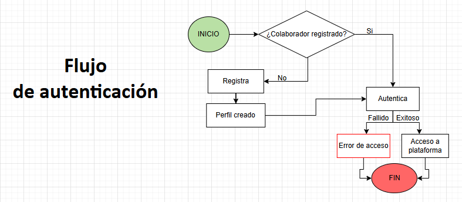
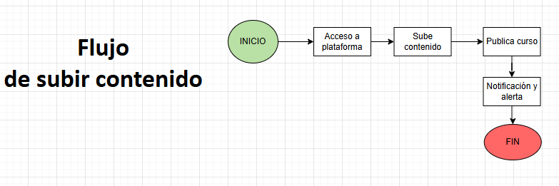
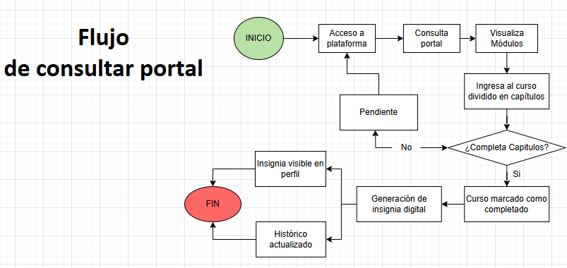

<!-- TOC -->

* [Capacitanet - Backend](#capacitanet---backend)
* [CapacitaNet](#capacitanet)
  * [Descripción del proyecto](#descripción-del-proyecto)
    * [Contexto](#contexto)
    * [Objetivo general](#objetivo-general)
    * [Alcance](#alcance)
  * [Requerimientos](#requerimientos)
    * [Funcionales](#funcionales)
    * [No funcionales](#no-funcionales)
  * [Arquitectura y Diseño](#arquitectura-y-diseño)
    * [Diagrama de flujo del sistema](#diagrama-de-flujo-del-sistema)
    * [Diagrama de arquitectura del sistema](#diagrama-de-arquitectura-del-sistema)
  * [Historias de Usuario y Épicas](#historias-de-usuario-y-épicas)
    * [Épicas](#épicas)
    * [Historias de Usuario](#historias-de-usuario)
        * [Funcionalidades actuales](#funcionalidades-actuales)
        * [Próximos pasos (en desarrollo / backlog)](#próximos-pasos-en-desarrollo--backlog)
  * [Instalación y Configuración](#instalación-y-configuración)
    * [Requisitos previos (lenguaje, frameworks, librerías)](#requisitos-previos-lenguaje-frameworks-librerías)
        * [Herramientas y dependencias](#herramientas-y-dependencias)
        * [Desarrollo y control de versiones](#desarrollo-y-control-de-versiones)
        * [Bases de datos y almacenamiento](#bases-de-datos-y-almacenamiento)
        * [Seguridad e infraestructura en AWS](#seguridad-e-infraestructura-en-aws)
    * [Clonar el repositorio](#clonar-el-repositorio)
    * [Configuración inicial](#configuración-inicial)
  * [Uso de la Aplicación](#uso-de-la-aplicación)
    * [Instrucciones para el usuario final](#instrucciones-para-el-usuario-final)
  * [Contribución](#contribución)
    * [Guía para contribuir al proyecto](#guía-para-contribuir-al-proyecto)
    * [Normas de codificación](#normas-de-codificación)
    * [Proceso de revisión y aceptación de cambios](#proceso-de-revisión-y-aceptación-de-cambios)
  * [Contacto](#contacto)
<!-- TOC -->

# CapacitaNet

## Descripción del proyecto
### Contexto
Es una plataforma interna que permite a los colaboradores acceder, gestionar y registrar capacitaciones técnicas organizadas por módulos, con un sistema de seguimiento de progreso y generación automática de insignias digitales como reconocimiento.
### Objetivo general
Desarrollar una plataforma interna de capacitación que centralice y organice cursos técnicos en módulos, permita a los colaboradores gestionar su formación, realizar seguimiento de su progreso y recibir automáticamente insignias digitales como reconocimiento de los logros alcanzados.
### Alcance
El proyecto comprende el diseño, desarrollo e implementación de una plataforma interna de capacitación que permitirá a los colaboradores:

- Registro y autenticación de usuarios mediante credenciales corporativas (correo institucional).
- Gestión de contenidos: subir y consultar materiales en distintos formatos (videos, PDF, PPT, guías, DOCX).
- Organización de cursos por módulos técnicos (Fullstack, APIs e Integraciones, Cloud, Data Engineer), estructurados en capítulos.
- Seguimiento de progreso: visualizar cursos iniciados, en progreso y completados, así como mantener un histórico de formación.
- Escalabilidad y accesibilidad: plataforma disponible vía web, diseñada para crecer en contenidos y usuarios.
- Seguridad: validación de acceso restringido al dominio corporativo, manejo seguro de datos y control de permisos.
## Requerimientos
### Funcionales
- RF001: Registro y autenticación de usuarios mediante credenciales corporativas.
- RF002: Gestión de contenidos en múltiples formatos (videos, PDF, PPT, guías, DOCX).
- RF003: Organización de cursos por módulos técnicos y capítulos.
- RF004: Seguimiento del progreso de los cursos (pendientes, en progreso, completados).
- RF005: Generación automática de insignias digitales por cada curso completado. 
- RF006: Notificaciones de nuevos cursos en el portal y por correo.
- RF007: Visualización del perfil del colaborador con su historial de formación y logros.
### No funcionales
- RNF001: La plataforma debe ser segura para autenticarse con credenciales corporativas (usuario de red o correo institucional).
- RNF002: La plataforma debe ser escalable para soportar un aumento en el número de usuarios y contenidos.
- RNF003: La interfaz de usuario debe ser intuitiva y fácil de navegar.
- RNF004: La plataforma debe ser compatible con los principales navegadores web (Chrome, Firefox, Edge, Safari).
- RNF005: La plataforma debe cumplir con las normativas de privacidad y protección de datos aplicables.
## Arquitectura y Diseño
### Diagrama de flujo del sistema



### Diagrama de arquitectura del sistema

## Historias de Usuario y Épicas
### Épicas
- EP001: Gestión de usuarios
- EP002: Gestión de contenido
- EP003: Seguimiento de progreso
- EP004: Portal capacitaciones
- EP005: Notificaciones
### Historias de Usuario
#### Funcionalidades actuales
- HU001: Como colaborador, quiero poder registrarme y acceder usando mi usuario de red o correo corporativo para ingresar al portal de capacitaciones de manera segura.
- HU002: Como usuario del portal, quiero subir videos, documentos PDF, presentaciones y guías para poner a disposición del personal el material de capacitación.
- HU003: Como usuario del portal, quiero visualizar los cursos organizados por módulos (Fullstack, APIs e Integraciones, Cloud, Data Engineer) para identificar fácilmente el área de formación de mi interés.
- HU004: Como usuario del portal, quiero ver el avance de los cursos que he realizado, para hacer seguimiento a mi proceso de capacitación.
#### Próximos pasos (en desarrollo / backlog)
- HU005: Como usuario del portal, quiero recibir una insignia digital al completar un curso para reconocer y visualizar mis logros en el perfil.
- HU006: Como usuario del portal, quiero que cada curso esté dividido en capítulos para avanzar de forma estructurada y marcar mi progreso por secciones.
- HU007: Como usuario del portal, quiero recibir notificaciones (correo o alerta en el sistema) cuando haya un nuevo curso disponible para mantenerme informado de las capacitaciones.
## Instalación y Configuración
### Requisitos previos (lenguaje, frameworks, librerías)
#### Herramientas y dependencias
- **Gradle** – Gestor de dependencias
- **Java 21** – Lenguaje principal
- **Spring Boot 3.5.4** – Framework para la aplicación
- **Arquitectura limpia** – Patrón de diseño
- **Lombok** – Reducción de código
- **JaCoCo** – Generación de reportes de cobertura de pruebas
- **PITEST** – Pruebas de mutación
- **SonarQube** – Análisis estático y buenas prácticas
#### Desarrollo y control de versiones
- **Git**
- **Editor de código**: Visual Studio Code o IntelliJ IDEA (recomendado)
- **Experiencia en autenticación/autorización** con **JWT**
#### Bases de datos y almacenamiento
- **DynamoDB**:
    - 2 tablas → `Usuarios` y `Cursos`
- **S3**:
    - 1 bucket para almacenamiento de contenido
#### Seguridad e infraestructura en AWS
- **IAM**:
    - 2 grupos de usuarios (con permisos independientes para DynamoDB y S3)
    - 1 usuario por grupo para uso en la aplicación
### Clonar el repositorio
```bash
git clone https://github.com/kvsaenz/capacitanet.git    
cd  capacitanet 
```
### Configuración inicial
Crear variables de ambiente
- aws.dynamodb.endpoint=https://dynamodb.us-east-1.amazonaws.com
- aws.region=us-east-1;
- AWS_ACCESS_KEY_ID_DYNAMO=xxxxxxPxxxxxxxxxRxxxxxxxxxx4x
- AWS_SECRET_ACCESS_KEY_DYNAMO=xxxxxxxxxxxxxV1CKIxvWSxxxxxxxxxxxxxxxx
- SECRET_KEY=xxxxxxxxxxxxxxxxx7pTnxxxxxxxxxxxUxxvxxxU
- AWS_ACCESS_KEY_ID_S3=AKxxxxxxxxxxQ3xxxxxxxxC6x3M4
- AWS_SECRET_ACCESS_KEY_S3=xxxxxxxxxTNxxxxxxCSxxxxxxBxxxxxoo

La aplicación backend expuesta por el puerto 9080
## Uso de la Aplicación
### Instrucciones para el usuario final
1. Acceder a la plataforma mediante el navegador web.
2. Registrarse o iniciar sesión con las credenciales corporativas.
3. Explorar los cursos disponibles organizados por módulos.
4. Seleccionar un curso para ver los detalles y comenzar la capacitación.
5. Seguir el progreso del curso y completar los capítulos.
   
## Contribución
### Guía para contribuir al proyecto
1. Crear una copia independiente del proyecto.
2. Crear una nueva rama para la característica o corrección de errores (`git checkout -b feature/nueva-caracteristica`).
3. Realizar los cambios necesarios y hacer commit (`git commit -m 'Agrega nueva característica'`).
4. Subir los cambios (`git push origin feature/nueva-caracteristica`).
5. Abrir un Pull Request en el repositorio original.
### Normas de codificación
- Escribir comentarios claros y concisos.
- Mantener el código modular y reutilizable.
- Realizar pruebas unitarias para nuevas funcionalidades.
### Proceso de revisión y aceptación de cambios
- Los Pull Requests serán revisados.
- Se deben aprobar los cambios antes de ser fusionados en la rama principal.
- Se pueden solicitar cambios adicionales si es necesario.
## Contacto
- Nombre: Katherin Saenz
- Email: ktherin2310@gmail.com

